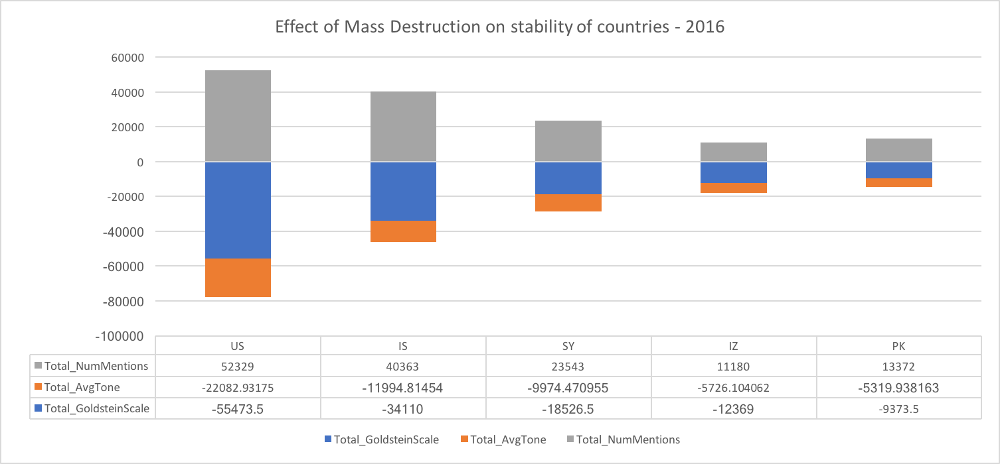
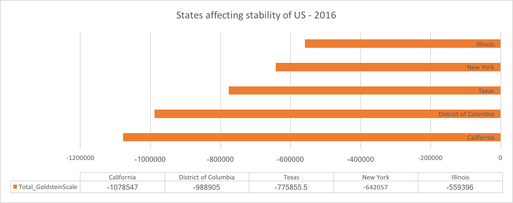
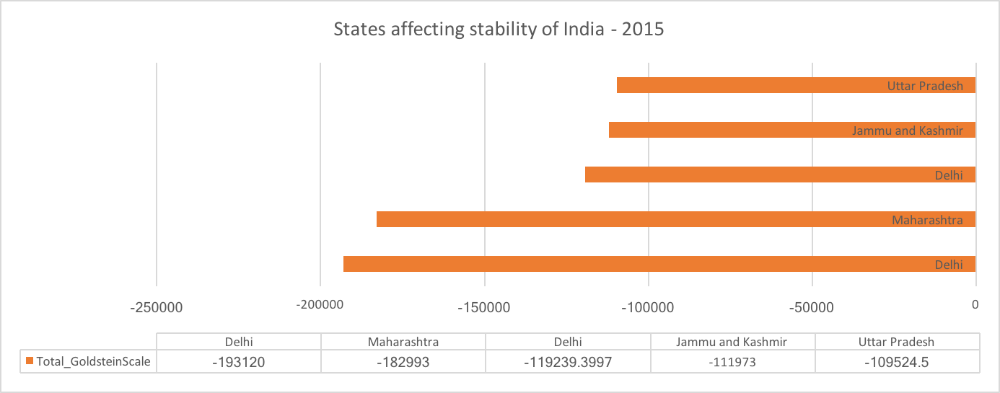
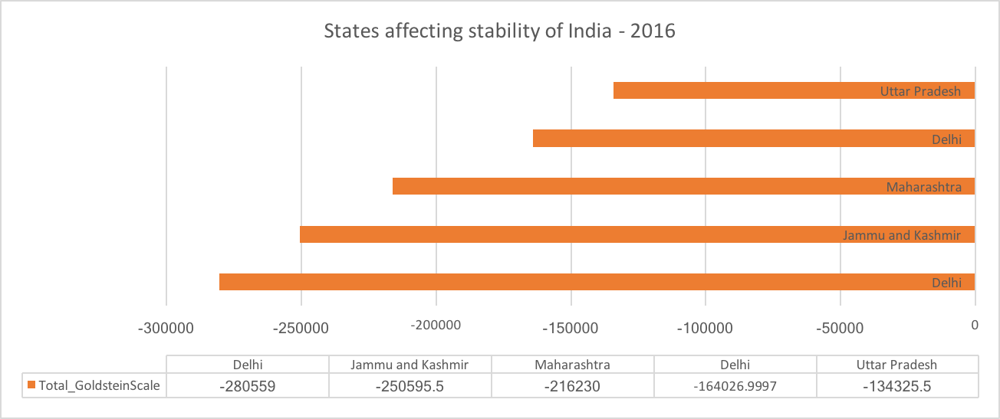
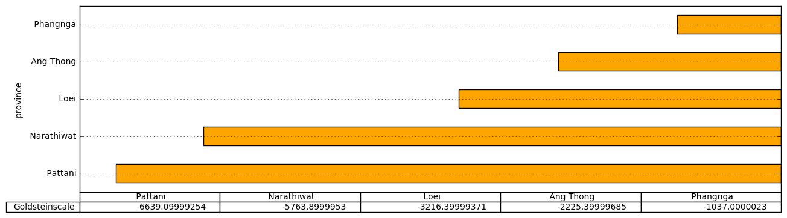

# Project 3: Deliverable II

https://www.cs.usfca.edu/~mmalensek/courses/cs686/projects/project-3.html

# Collaboration plan
## Team Members:
Mathieu Clement,
Anjani Bajaj,
Bhargavi Kommineni,
Surada Lerkpatomsak,
Neha Bandal

# Dataset 
## GDELT(The Global Database of Events, Language and Tone)
## Goal of the Project: Visualize, explore, and export the GDELT Event Database.
By quantitatively codifying human society’s events, dreams and fears,  we are planning to map happiness and conflict, provide insight to vulnerable populations, and even potentially forecast global conflict in ways that allow us as a society to come together to deescalate tensions, counter extremism.

**Instructor Comment**: This sounds pretty amazing, but is there something a bit more concrete you'll be doing? :-) Also, since you requested to have your group name changed, let me know what you'd like it changed to (although I think it's awesome as-is!!).

# Collecting and cleaning the data

## File download and format conversion
To speed up the download process we grabbed ZIP files from the GDELT website.
There is one for every day of the years **2015 and 2016 which we are interested in.**
ZIP archives, however, are not supported natively by Spark.
So to load those files but still save space on our hard drives we unzipped them and gzipped them instead, because GZIP is supported natively by Spark.

## Preprocessing
No preprocessing was otherwise necessary as the GDELT dataset is pretty clean, with one major exception:

As mentioned below, it seems that most of the source URLs lead to nowhere. If all our queries require the availability of that source, then it would be a good, but initially extremely time-consuming idea, to go through the list and remove all URLs that don't resolve to an actual article.

To do that we need to decide where we actually want to remove those URLs from. We could either use a Spark filter (you can't drop rows from a data frame or an RDD because they are immutable, following a WORM access principle: write once read many), or change it directly in our data files, like so:

```python
import gzip
import requests

SOURCE_URL_COL = 57

with gzip.open('20150101.export.CSV.gz', 'r') as filer:
    with gzip.open('2015.0101.export.curated.CSV.gz', 'w') as filew:
        for line in filer:
            cols = line.split('\t')
            source_url = cols[SOURCE_URL_COL].rstrip("\r\n")
            r = requests.get(source_url)
            if r.status_code != 404:
                filew.write(line)
```

It would probably be a good idea to multithread this code to avoid waiting for every page to load before moving on to the next one, although if we want to preserve the original order, we will need a clever file writer.

## Feature names
The GDELT website also provides the header of the CSV file (i.e. the name of the columns separated by tab characters). We converted that to newline-separated values (though not really necessary), and suffixed every column but character-type column with a color and the type it should be parsed at, e.g. IntegerType.
We then created a StructType with StructFields.

Here is the code:

```python
from pyspark.sql.types import StructType, StructField, StringType, FloatType, LongType, IntegerType, BooleanType

types = {
    'Float': lambda: FloatType(),
    'Integer': lambda: LongType(), # the spec does not distinguish between integer and long, so long it is
    'Long': lambda: LongType(),
    'Bool': lambda: IntegerType() # like in the NAM dataset, booleans are expressed as numbers (0 and 1)
}

feats = []
with open('CSV.header.txt') as header_file:
    for lineno, line in enumerate(header_file):
        line = line.strip()
        if ':' in line:
            feat_name, type_name = line.split(':')
            feats.append(StructField(feat_name, types[type_name](), True))
        else:
            feats.append(StructField(line, StringType(), True))
            
schema = StructType(feats)
```

We used the GDELT file format specification see below) to annotate the header file with type information.

# Info about features

The [GDELT file format](http://data.gdeltproject.org/documentation/GDELT-Data_Format_Codebook.pdf) (it's really a tab-separated text file) contains records related to events around the world. It uses the [CAMEO](http://data.gdeltproject.org/documentation/CAMEO.Manual.1.1b3.pdf) taxonomy to classify the organisms (government and non-government), actors (such as persons, multinational companies, governments), and actions (warn, appeal, decline to comment, accuse, protest, impose,  etc.)

Each event can be qualified using the following groups of attributes:

  - Event 
    * Date: actually the date of publication in the media, but 97 % of the news relate to the current day
    * Location: where an event took place, even when it involves two actors associated with other countries, e.g. an American citizen appealing against a British citizen in the court of Human Rights in Strasbourg, France.
    * Type, code, etc.: event classification
    * Statistics: # of mentions, # of sources, average tone \[positive or negative\], impact of the news on the stability of the country, 
  - Actor 1: the main party or one of the two main parties involved
  - Actor 2: the second party involved. In some cases, there is no second actor.
  - Source URL: Link to the article a record is extracted from
 
Most attribute contain character information such as country codes and actor type codes.
A few are related to dates (year, month-year, SQL date...)
And then there are the numeric ones:

  - Event location geocoordinates
  - AvgTone, as explained above, which is defined between -100 for an extremely negative event to +100 for an extremely positive event. A small riot will have a slightly low average tone, where as the end of a war would get an extremely positive tone.
  - Number of articles, sources, and mentions: one or more
  - Goldstein Scale: expresses whether the event will have a good impact (+10) or a bad impact (-10) to the country in question, with every value inbetween.
  - QuadClass: which of the 4 main classification groups applies (Verbal/Material Cooperation/Conflict)

# Analysis

We played the role of the professor a little bit and imagined a couple of questions:

## Top Event code in 2015
In 2015 most of the stories which has maximum mentions fall under event code 010 **(Make statement, not specificed below)** with **total number of mentions 81,576,113.**
It includes events like 'All public statements expressed verbally or in action not otherwise specified'.
Example- 

|News|Country|Date|Source|
|---|---|---|---|
|BJP links Gandhis to tainted company|India|Oct 23, 2015|[Source](https://timesofindia.indiatimes.com/india/BJP-links-Gandhis-to-tainted-company/articleshow/49498732.cms)|
|Chanel Partners With Tribeca Festival for Women's Film Program|US|October 22, 2015,|[Source](https://www.bloomberg.com/news/articles/2015-10-22/chanel-partners-with-tribeca-festival-for-women-s-film-program)|
|Thailand police seize meth tablets worth B45m|Thailand|October 21, 2015|[Source](http://www.customstoday.com.pk/thailand-police-seize-meth-tablets-worth-b45m/)|


## What are the most discussed topics implicating both the United States and Switzerland?

To answer this question, we simply filtered records by looking at the attributes *Actor1CountryCode* and *Actor2CountryCode*, and then sorted by "number of mentions":

```python
def either_country_code(row, country1, country2):
    return (row.Actor1CountryCode == country1 and row.Actor2CountryCode == country2) or\
           (row.Actor1CountryCode == country2 and row.Actor2CountryCode == country1)

df\
    .rdd\
    .filter(lambda row: either_country_code(row, 'CHE', 'USA'))\
    .takeOrdered(10, key= lambda row: -row.NumMentions)
```

We had to run this job multiple times because we used the wrong code for countries. For some strange reasons the GDELT data format uses two character country codes in some cases, and three character country codes (which they define in the CAMEO standard) in others. Defining a new standard for country codes seems a bit weird, but they must have their reasons...

`takeOrdered` takes two arguments:

  - number of records to "take"
  - the key used for sorting. In this we use "NumMentions", but because we want reverse ordering we negate the attribute. 

The results:

|Number of mentions|Date|Event location|Event description|Source|
|---|---|---|---|---|
|565|August 14, 2016|Sennwald, Switzerland|Swiss train attack suspect, female victim die of wounds|[Source](https://www.seattletimes.com/nation-world/swiss-police-no-indication-of-terrorism-in-train-attack/)|


Wait, but we asked for 10 results!
And we got those. Unfortunately the first 9 resolved to a "Page Not Found." It seems that news agencies don't keep stuff online or they changed their website architecture since then.
In an application where inaccessible sources render records useless, it would be a good idea to periodically check that links do resolve to articles that are still up. **This 10 % rate that we observed is a significant concern.**

The web archive helped a bit. For instance there was one article published on SFGate talking about both the United Nations (a SF founded institution with headquarters in NYC) and a program of UNICEF in Switzerland.

Another article explains how surfers found some awesome waves after a hurricane hit in Hawaii. There doesn't seem to be any link to Switzerland. Further more the US "location" in the record is Big Island, New York, although there is no mention of that place in the article (probably not the best spot for surfing!). This shows that the dataset is not 100 % accurate. => We exclude the possibility that the web archive saved the wrong content for that URL because there is come correlation with the article and other attributes.

## Compare the news coverage of Donald J. Trump vs Hillary Clinton

So the first idea would be to take a look at the data in the terminal:

```bash
zcat *.gz | awk -F"\t" 'tolower($58) ~ /.*[^a-z]trump[^a-z].*/ { print $0; }'
```

A prior investigation showed that Trump's name didn't appear as an actor name, so we had to look into the URLs instead. We had to make sure the letters "trump" were not part of a bigger word such as "www.thetrumpet.com".

Piping the output of the command above to `wc -l` would solve the question, but that wouldn't be fun, would it?

Let's do it with Spark (with the advantage of parallelization):

```python
import re

url = 'http://www.politics.co.uk/comment-analysis/2015/01/06/comment-arms-sales-Trump-human-rights-as-uk-enters-bahrain'
url2 = 'http://www.thetrumpet.com/blabla'

pattern = re.compile('[^a-z]trump[^a-z]')

assert pattern.search(url.lower())
assert not pattern.search(url2.lower())

df\
    .rdd\
    .filter(lambda row: row.SOURCEURL and pattern.search(row.SOURCEURL.lower()) is not None)\
    .count()
```

630507

We repeat this process for the keyword "hillary", and we get a count of:

105121

I know what you are thinking: but Trump got elected November 8, 2016, so of course there's going to be more press coverage, but no, because he wasn't elected for 94 % of the period studied.
It just seems like the media had more to say about that candidate compared to the other.

## Top Stories of United States

For this analysis, we tried to sort all the records based on numMention attribute in decreasing order to get the top stories.

In 2015:

|GoldsteinScale|Num-Mentions|Num-Articles|Story|
|---|---|---|---|
|-10|31182|11840|[Source](http://www.sfgate.com/nation/article/Colorado-movie-theater-shooting-victims-brace-for-6225228.php)
|-10|29730|7579|[Source](http://abcnews.go.com/US/meet-james-holmes-trial-jurors/story?id=30596586)
|0|28010|10915|[Source](http://durangoherald.com/article/20150425/NEWS01/150429702/0/NEWS01/Homeless-fight-for-their-rights)
|2.8|22453|4929|[Source](http://www.news.com.au/world/north-america/a-train-headed-for-new-york-has-crashed-and-derailed-in-philadelphia/story-fnh81jut-1227353314298)

In 2016:

|GoldsteinScale|Num-Mentions|Num-Articles|Story|
|---|---|---|---|
|-10|51231|6243|[Source](https://www.nbcdfw.com/news/local/Protests-in-Dallas-Over-Alton-Sterling-Death-385784431.html)
|-10|39975|33706|[Source](http://www.cnn.com/2016/06/12/us/orlando-shooting-what-we-know/index.html)
|-10|32864|29460|[Source](http://boingboing.net/tag/Alton-Sterling)
|-10|32325|29183|[Source](http://www.wfaa.com/features/are-cameras-impacting-how-police-officers-do-their-job/266679876)
|-10|26905|23541|[Source](http://kboi2.com/news/nation-world/sisters-brothers-friends-victims-who-we-lost-in-the-orlando-nightclub-shooting)

## Top Stories of India

For this analysis, we tried to sort all the records based on numMention attribute in decreasing order to get the top stories.

In 2015:

|GoldsteinScale|Num-Mentions|Num-Articles|Story|
|---|---|---|---|
|2.8|7358|7294|[Source](http://www.bbc.com/news/world-asia-34636269)
|1.9|7224|7160|[Source](http://www.bbc.com/news/world-asia-34636269)
|4|5944|5904|[Source](http://www.sify.com/news/rs-passes-private-member-s-bill-on-transgenders-a-first-in-45-years-news-national-peyvEqhdgeadd.html)

In 2016:

|GoldsteinScale|Num-Mentions|Num-Articles|Story|
|---|---|---|---|
|1|7896|7896|[Source](https://www.infoworld.com/article/3045581/cloud-computing/why-microsoft-azure-is-king-of-the-hill.html)
|7|6792|6792|[Source](https://www.infoworld.com/article/3045581/cloud-computing/why-microsoft-azure-is-king-of-the-hill.html)
|0|6372|6336|[Source](http://www.1310news.com/2016/02/21/gunman-kills-6-at-apartment-complex-dealership-restaurant/)
|4|4859|4438|[Source](https://www.ndtv.com/india-news/pak-files-case-against-baloch-leaders-for-supporting-pm-modis-independence-day-speech-1448774)
|4|4859|4438|[Source](https://www.ndtv.com/india-news/pak-files-case-against-baloch-leaders-for-supporting-pm-modis-independence-day-speech-1448774)

## Top Stories of Thailand

In 2015:

|GoldsteinScale|Num-Mentions|Num-Articles|Story|
|---|---|---|---|
|-5.0|3445|2136|[Source](http://www.canberratimes.com.au/world/police-arrest-suspect-over-bangkok-shrine-bombing-20150829-gjaraj.html)
|0.0|3365|3356|[Source](http://www.echonews.com.au/news/bangkok-bombing-police-release-sketch-cctv-suspect/2746755/)
|-4.0|3180|3180|[Source](http://www.montereyherald.com/arts-and-entertainment/20150520/the-latest-on-rohingya-gambia-offers-to-resettle-migrants)
|2.8|2852|2852|[Source](http://www.dailyliberal.com.au/story/3532618/travel-deals-cheap-flights-with-malaysia-airlines-year-end-super-specials-sale/) 

In 2016:

|GoldsteinScale|Num-Mentions|Num-Articles|Story|
|---|---|---|---|
|-2.0|5625|5625|[Source](http://www.seattletimes.com/nation-world/thais-vote-on-new-constitution-that-could-dilute-democracy/)  
|4.0|5476|5476|[Source](http://www.thejakartapost.com/seasia/2016/10/14/thais-gripped-by-grief-after-beloved-kings-death-.html) 
|2.8|4497|4173|[Source](http://m.nzherald.co.nz/travel/news/article.cfm?c_id=7&objectid=11630822)
|4.0|4104|4104|[Source](http://www.blacktownsun.com.au/story/3842066/last-fridge-rolls-off-the-line-at-electrolux-factory/?cs=1683) 


## Aid relationship between countries

All Event codes for analysis of different types of events are from [documentation](https://www.gdeltproject.org/data/documentation/CAMEO.Manual.1.1b3.pdf) related to dataset:

To do this analysis, we have filtered all the records with events related to aid based on EventRootCode which is "17" for all types of aids in that category and grouped by Actor1CountryCode , Actor2CountryCode and EventBaseCode.To get mutual relation between two countries created a copy of same values and did a join using Actor1CountryCode, Actor2CountryCode.And then by filtering relations within same country and sorting based on numMentions, listed the countries which are highly related in terms of aids.

In 2015, top pair of countries involved in providing different types of aid to each other are:

|Country-1|Country-2|Type of Aid|
|---|---|---|
|Syrian Arab Republic|United States|Humanitarian aid, Grant Asylum|
|Serbia|Syrian Arab Republic|Military Aid|
|Iceland|United States|Economic Aid|
|Switzerland|United States|Economic Aid|
|United States|Canada|Economic Aid|

Statistics related to numMentions and numArticles related to same are shown in figure below:


In 2016, top pair of countries involved in providing different types of aid to each other are:

|Country-1|Country-2|Type of Aid|
|---|---|---|
|Iceland|United States|Economic Aid|
|Serbia|Syrian Arab Republic|Military Aid|
|Syrian Arab Republic|United States|Aid, Grant Asylum|
|Switzerland|United States|Economic Aid|
|United States|Canada|Economic Aid|

Statistics related to numMentions and numArticles related to same are shown in figure below:


## Countries involved in Deportation

To do this analysis, we have done something similar to aid analysis but with an EventRootCode "17" and for events specific to deportation, targeted events with EventBaseCode "174".

In 2015, top pair of countries involved in the news of Deportation are:

|Country-1|Country-2|Reason|
|---|---|---|
|Greece|Pakistan|Expel or deport individuals, Arrest (or) detain|
|Fiji|New Zealand|Expel or deport individuals, Impose administrative sanctions|
|Ecuador Venezuela|Bolivarian Republic of Croatia United States|Expel or deport individuals, Arrest (or) detain|
|Djibouti|United Arab Emirates|Expel or deport individuals, Arrest (or) detain|
|United Kingdom|Nicaragua|Expel or deport individuals, Arrest (or) detain|

Statistics related to numMentions and numArticles related to same are shown in figure below:


In 2016, top pair of countries involved in the news of Deportation are:

|Country-1|Country-2|Reason|
|---|---|---|
|Taiwan|Province of China Kenya|Expel or deport individuals|
|Egypt|Cyprus|Expel or deport individuals, Arrest (or) detain|
|Greece|Pakistan|Expel or deport individuals|
|Rwanda|Netherlands|Expel or deport individuals|
|Syrian Arab Republic|Uruguay|Expel or deport individuals, Arrest (or) detain|

Statistics related to numMentions and numArticles related to same are shown in figure below:


## Analysis on how Mass Destruction affects stability of countries

For this analysis, we have used EventRootCode attribute to filter all the events related to Mass Destruction with Code "20" and have used attribute goldsteinscale to determine the stability of country based on those events

In 2015:

During 2015, stability of follwing countries is impacted alot due to Mass Destruction which involves mass killings, mass expulsion, using weapons of mass destruction etc.

|Country Code|Country Name|
|---|---|
|US|United States|
|IS|Israel|
|FR|France|
|SY|Syria|
|RW|Rwanda|

Statistics related to GoldsteinScale, AvgTone and NumMentions related to same are shown in figure below:


In 2016:

|Country Code|Country Name|
|---|---|
|US|United States|
|IS|Israel|
|SY|Syria|
|IZ|Iraq|
|PK|Pakistan|

Statistics related to GoldsteinScale, AvgTone and NumMentions related to same are shown in figure below:



## Analysis on which pair of countries are involved in Mass destruction the most:

In 2015:

|Country 1|Country 2|Reason|
|---|---|---|
|France|United Kingdom|Engage in mass killings|
|Rwanda|United Kingdom|Engage in mass killings|
|Syria|Turkey|Engage in ethnic cleansing|
|Somalia|Kenya|Engage in mass killings|
|France|Congo|Engage in mass killings|

Statistics related to NumEvents, GoldsteinScale, AvgTone and NumMentions related to same are shown in figure below:


In 2016:

|Country 1|Country 2|Reason|
|---|---|---|
|Syria|Turkey|Engage in ethnic cleansing|
|Israel|United States|Engage in ethnic cleansing|
|Armenia|Azerbaijan|Engage in ethnic cleansing|
|Russia|Syria|Engage in mass killings|
|Israel|Lebanon|Engage in mass killings,Engage in ethnic cleansing|

Statistics related to NumEvents, GoldsteinScale, AvgTone and NumMentions related to same are shown in figure below:


## Top States affecting stability of Countries and events related to it

For this analysis, we have filtered records belonging to particular country and extract state where the particular event happened.Grouped the records based on state and event, ordered them in increasing order of Goldsteinscale to get states which affected stability of country. (More negative the Goldsteinscale value is more it affects the stability of country negatively)

For United States:
In 2015:

|State|Event affecting stability of country|GoldsteinScale Value|
|---|---|---|
|California|All the events that are related to fight|-974943|
|District of Columbia|All the events that are related to fight|-935352.5|
|Texas|All the events that are related to fight|-593123|
|New York|All the events that are related to fight|-576250.5|
|Illinois|All the events that are related to fight|-462968|

Statistics related to GoldsteinScale to same are shown in figure below:


In 2016:

|State|Event affecting stability of country|GoldsteinScale Value|
|---|---|---|
|California|All the events that are related to fight|-1078547|
|District of Columbia|All the events that are related to fight|-988905|
|Texas|All the events that are related to fight|-775855.5|
|New York|All the events that are related to fight|-642057|
|Illinois|All the events that are related to fight|-559396|

Statistics related to GoldsteinScale to same are shown in figure below:



For India:
In 2015:

|State|Event affecting stability of country|GoldsteinScale Value|
|---|---|---|
|Delhi|All the events that are related to fight|-193120|
|Maharashtra|All the events that are related to fight|-182993|
|Delhi|Coerce related news(Eg: impose curfew,destroy property etc.)|-119239.3|
|Jammu and Kashmir|All the events that are related to fight|-111973|
|Uttar Pradesh|All the events that are related to fight|-109524.5|

Statistics related to GoldsteinScale to same are shown in figure below:



In 2016:

|State|Event affecting stability of country|GoldsteinScale Value|
|---|---|---|
|Delhi|All the events that are related to fight|-280559|
|Jammu and Kashmir|All the events that are related to fight|-250595.5|
|Maharashtra|All the events that are related to fight|-216230|
|Delhi|Coerce related news(Eg: impose curfew,destroy property etc.)|-164026.9|
|Uttar Pradesh|All the events that are related to fight|-134325.5|

Statistics related to GoldsteinScale to same are shown in figure below:



For Thailand:

In 2015: 

|State|Event affecting stability of country|GoldsteinScale Value|
|---|---|---|
|Bangkok|All the events that are related to fight|-9138.00000141561|
|Narathiwat|All the events that are related to fight|-4949.7999966442585|
|Pattani|All the events that are related to fight|-3243.7999983131886|
|Surat Thani|All the events that are related to fight|-2309.4000106677413|
|Nakhon Si Thammarat|All the events that are related to fight|-982.7999975681305|

In 2016:

|State|Event affecting stability of country|GoldsteinScale Value|
|---|---|---|
|Pattani|All the events that are related to fight|-6639.099992543459|
|Narathiwat|All the events that are related to fight|-5763.899995304644|
|Bangkok|All the events that are related to fight|-3216.39999371022|
|Ang Thong|All the events that are related to fight|-2225.3999968469143|
|Phangnga|All the events that are related to fight|-1037.0000023022294|

Statistics related to GoldsteinScale to same are shown in figure below:



The biggest news in 2015 is about "Bangkok bombing" which happened in Bangkok, killing 20 people and injuring 125. For Narathiwat, Pattani, Surat Thani and Nakhon Si Thammarat are Thailand's southern provinces. South Thailand insurgency is an ongoing conflict centered in southern Thailand which is going on more than 10 years and no signs of ending. In 2016, A British woman has died and a British man is missing after a speedboat capsized off a popular tourist island in Thailand. Thai tourist police said 32 passengers and four crew were on board the Ang Thong Explorer boat which was travelling from Mu Ko Ang Thong National Park when it hit a "big wave" and capsized at around 5pm local time. In Phangnga has Refugee Camps for Rohingya, Myanmar Refugees. The camps got bigger and bigger until 2016 which the camps cound not take more Refugees but also could not deny them because they did not have any place to go.
